# Penetration Testing Report — Footprinting & Network Scanning Phases

**WK2-PM1 & WK2-PM5 | Cybersecurity | Networkwalks**

| | |
|---|---|
| **Pentester Name (Cybersecurity Professional)** | Akintayo Akinjolie |
| **Program/Batch** | B083-Networkwalks |
| **Date** | 17 September 2026 |
| **Modules completed** | WK2-PM1 (Multiple Kali Tools), WK2-PM5 (Zenmap Scanning) |
| **Client/Target** | 1. Networkwalks.com (secured written permission already)   2. My own local lab network |
| **Permission secured from client?** | Yes |
| **Phases covered** | **Phase 1:** Reconnaissance & Footprinting   **Phase 2:** Scanning & Network Discovery |

---

## 1. Liability Disclaimer

I have performed these activities only on the systems and domains where I had secured written permission (networkwalks.com) or on devices/networks that I own myself (my own local lab network). All materials in this report are for education and research purposes only. Nothing here should be used to break the law. The instructor, the authors and Networkwalks are not responsible for what I or anyone else does with this knowledge. Every action I take is my own responsibility. Misuse of these techniques can lead to criminal charges, heavy fines, loss of employment and a permanent criminal record. In most countries, unauthorised access is a crime even when nothing is damaged.

## 2. Introduction

This report covers Week 2 of my Cybersecurity internship at Networkwalks. It documents two practical modules: footprinting the networkwalks.com domain using multiple Kali Linux tools (WK2-PM1), and scanning my own local lab network with Zenmap (WK2-PM5). Together, the two modules show how an attacker would move from gathering public information about a target, to mapping the live hosts and devices on a network.

All footprinting commands were run from a Kali Linux terminal against the live networkwalks.com domain, for which I had prior written permission. The network scanning was run from a Windows machine using Zenmap (the Nmap GUI) against my own local lab subnet. Every step below includes the exact command I ran, the result I observed, a screenshot as evidence, and a short note on why the finding matters from an attacker's point of view.

## 3. Tools Used

| Tool | Purpose |
|---|---|
| Kali Linux & Windows | Operating systems used for reconnaissance and scanning activities |
| WHOIS | Find domain registration details (owner/privacy proxy, dates, name servers) |
| whatweb | Fingerprint web technologies (server, CMS, plugins, IP) |
| nslookup | Resolve the domain name to its IP address using DNS |
| dnsrecon | Enumerate DNS records (SOA, NS, MX, TXT, SRV) and DNS server software |
| theHarvester | Passive OSINT harvesting — subdomains, emails, IPs, ASNs and breach data |
| curl -I | Read the HTTP response headers of the website |
| wafw00f | Detect whether a Web Application Firewall (WAF) protects the site |
| Zenmap (Nmap GUI) | Ping-scan the local subnet to find live hosts and MAC addresses |
| Windows CMD (ipconfig) | Identify the local IP address, subnet mask and default gateway |

---

## 4. Activities Performed

### 4.1 Footprinting & Reconnaissance

I performed reconnaissance against the `networkwalks.com` domain using seven Kali Linux tools: **WHOIS, WhatWeb, Nslookup, DNSRecon, theHarvester, Curl and Wafw00f**. Each tool was used to collect a different type of information about the target.

First, I used **WHOIS** to obtain publicly available domain registration information. The domain is registered with GoDaddy, was created on 6 November 2019 and is set to expire on 6 November 2027. The registrant's real identity is hidden behind privacy protection (Domains By Proxy, LLC), and the domain is locked against transfer, update, renewal and deletion. Two HostGator name servers (`ns6135` and `ns6136`) were also identified.

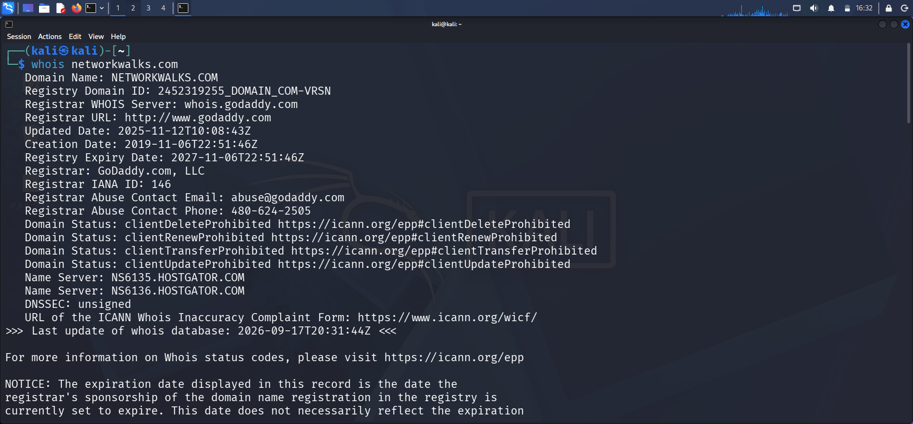
*Figure 1: WHOIS lookup showing registrar, registration dates, privacy protection and name servers for networkwalks.com.*

I then used **WhatWeb** to identify the technologies running on the website. The results identified **WordPress 7.1.1**, **WordPress Download Manager 3.3.58**, **Bootstrap 7.1.1** and **jQuery 3.7.1**, along with the server IP address (`192.232.216.135`), the page title "Networkwalks Academy", and a publicly exposed contact email address (`info@networkwalks.com`).

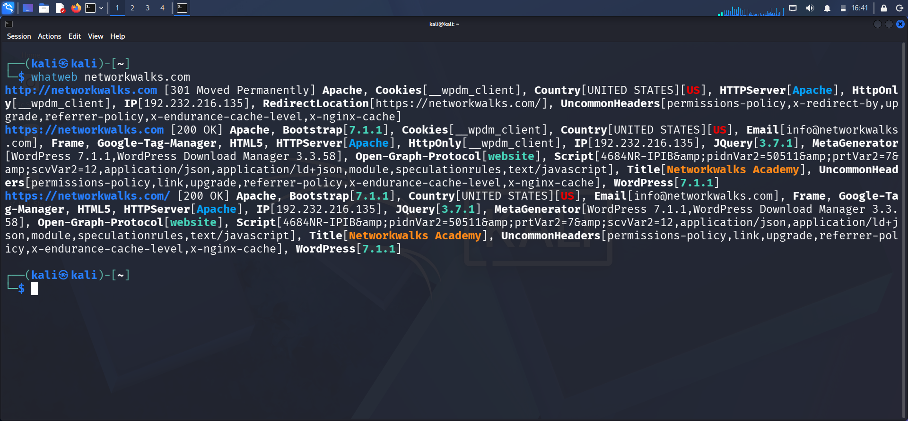
*Figure 2: WhatWeb fingerprinting result showing the CMS, plugin versions, server details and exposed email address.*

Using **Nslookup**, I resolved the domain name to its IP address. The result confirmed the same IP address identified by WhatWeb: `192.232.216.135`.

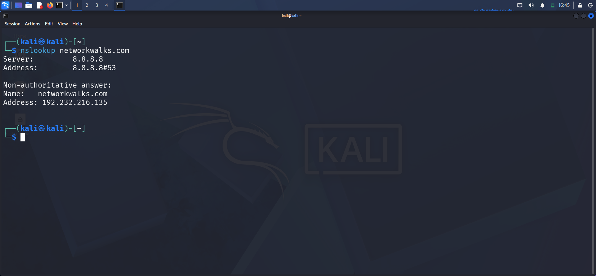
*Figure 3: Nslookup resolving networkwalks.com to 192.232.216.135.*

Next, I used **DNSRecon** to enumerate the domain's DNS records. The results provided the SOA and NS records, the mail server (`mail.networkwalks.com`), an SPF TXT record, a Google site-verification TXT record, and eight SRV records for Autodiscover email configuration pointing to cPanel's email discovery service. DNSRecon also disclosed the **BIND software version (9.16.23-RH)** running on both of the domain's name servers.

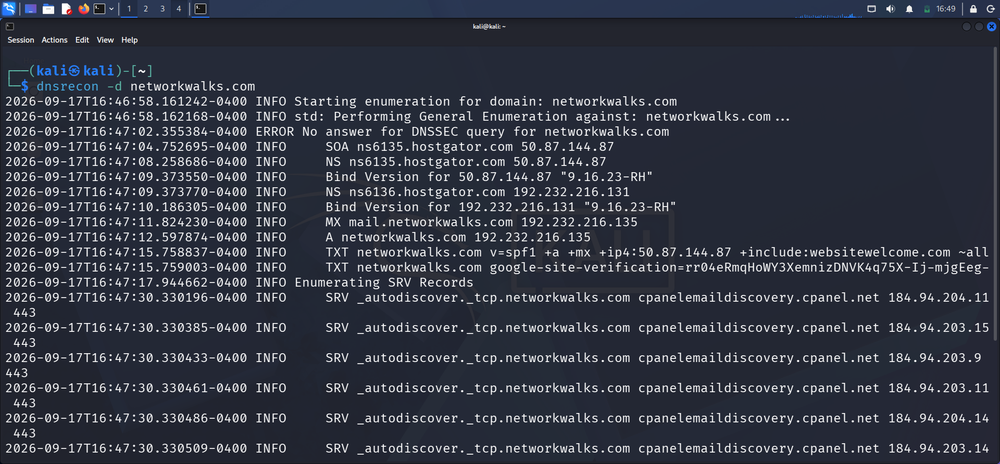
*Figure 4: DNSRecon enumerating SOA, NS, MX, TXT and SRV records, and disclosing the DNS server's BIND version.*

I then used **theHarvester** to passively gather OSINT on the domain. My first attempt scoped the search to a single source (`-l 1000 -b baidu`) to test the tool.

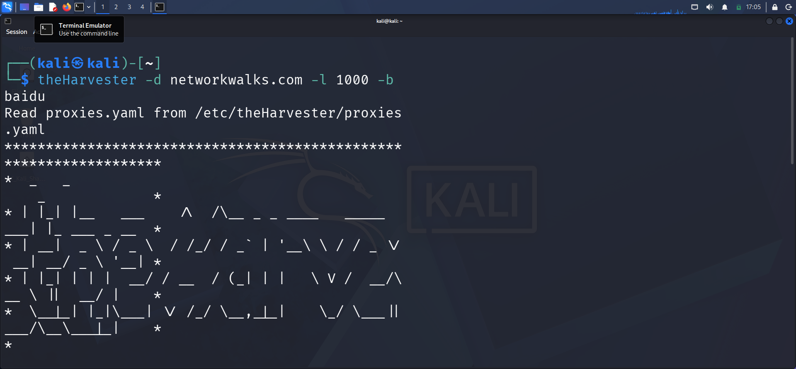
*Figure 5: Initial theHarvester run against networkwalks.com using the Baidu source.*

I then re-ran theHarvester across all available public sources (`-l 50 -b all`). Even though most API-key-gated sources were unavailable, the free/passive sources still returned useful results: **3 ASNs** (including Cloudflare's AS13335), **4 IP addresses** — notably both the Cloudflare edge IP (`172.67.198.228`) and what appears to be the real hosting origin IP (`192.232.216.135`) — **1 exposed email address**, and **21 subdomains/hosts**, including a full set of cPanel-related hostnames (autodiscover, cpanel, cpcalendars, cpcontacts, ftp, mail, webdisk, webmail). theHarvester's Hudson Rock module also reported **101 previously compromised credential records** associated with the domain.

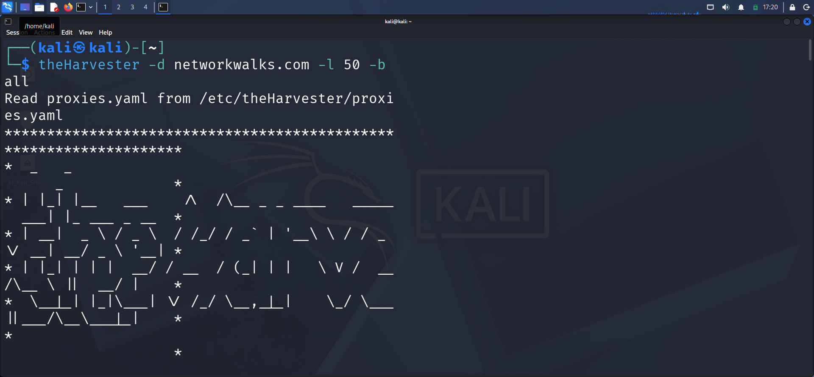
*Figure 6: theHarvester full run across all sources, showing ASNs, IPs, emails, subdomains and compromised-credential statistics.*

Finally, I used **Curl** with the `-I` option to inspect the HTTP response headers returned by the website. The response confirmed a 301 redirect from HTTP to HTTPS, identified the Apache web server, revealed the active WordPress security plugin ("Really Simple Security") via the `X-Redirect-By` header, and showed a `Permissions-Policy` header referencing Google reCAPTCHA, Cloudflare Turnstile and hCaptcha domains — indicating bot/CAPTCHA protection is in use on the site.

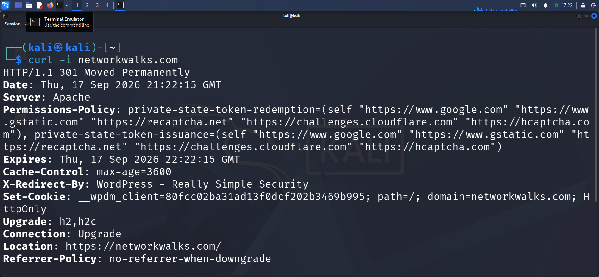
*Figure 7: Curl response headers showing the HTTP-to-HTTPS redirect, server software and security plugin disclosure.*

I also used **Wafw00f** to determine whether a Web Application Firewall was protecting the website. The result identified that `https://networkwalks.com` is behind **ModSecurity (SpiderLabs)**, detected after only 2 requests.

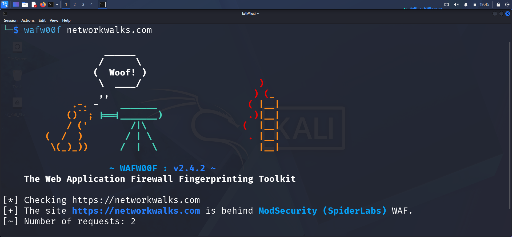
*Figure 8: Wafw00f identifying ModSecurity (SpiderLabs) as the Web Application Firewall protecting networkwalks.com.*

### 4.2 Network Scanning with Zenmap

For the second activity, I used **Zenmap** to perform network discovery on my own local lab network. The practical required me to identify my local IP address and subnet, discover live hosts, identify their IP and MAC addresses, and generate a network topology.

I first used the Windows `ipconfig` command to identify my local IP address and LAN subnet. This showed my machine's IPv4 address as `10.0.2.15`, subnet mask `255.255.255.0`, and default gateway `10.0.2.2`.

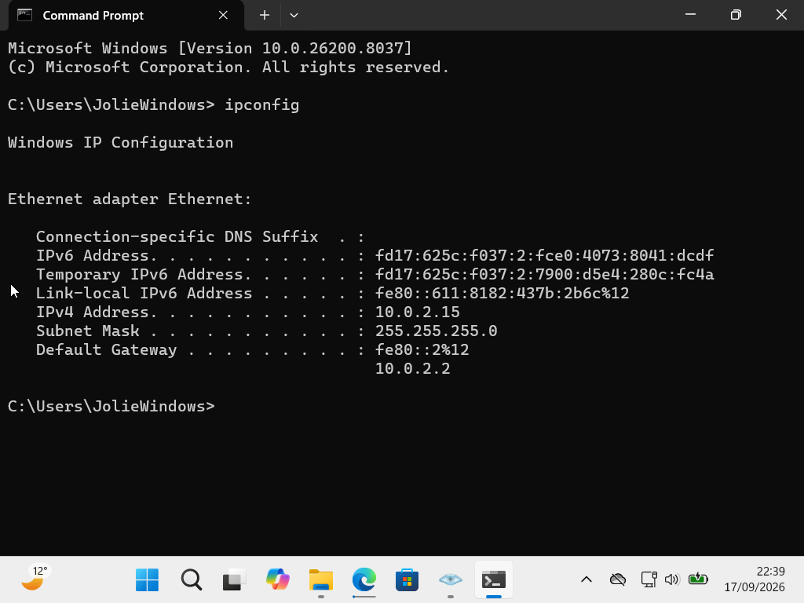
*Figure 9: Windows ipconfig output confirming the local IPv4 address, subnet mask and default gateway.*

I then entered the subnet (`10.0.2.0/24`) into Zenmap and selected the **Ping Scan** profile (`nmap -sn`) to identify active hosts without a full port scan. The scan completed in just over 4 seconds and identified three live hosts on the subnet: `10.0.2.2` (the gateway), `10.0.2.3`, and `10.0.2.15` (my own machine). The first two hosts returned a MAC address of `52:54:00:12:35:00`, identified as a **QEMU virtual NIC** — confirming this is a virtualised lab environment rather than a physical network.

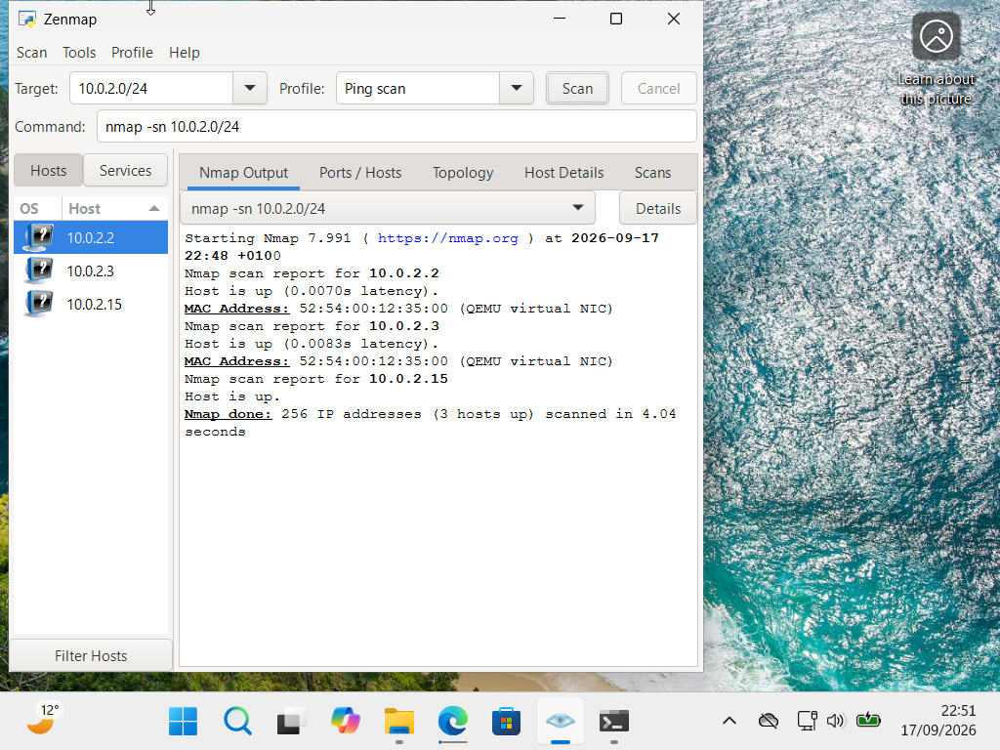
*Figure 10: Zenmap ping scan of 10.0.2.0/24 identifying three live hosts and their MAC addresses.*

After completing the scan, I opened the **Topology** tab in Zenmap and enabled the **Topology Legend** to understand the node colours and icons used in the graphic — for example, green nodes indicate hosts with fewer than three open ports, and the legend also explains router/switch/access-point icons and traceroute line styles.

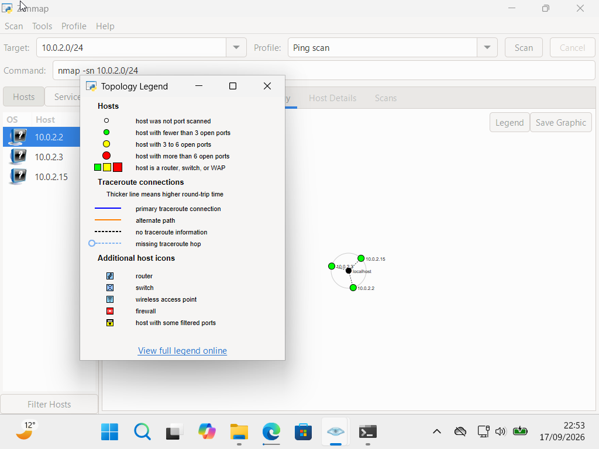
*Figure 11: Zenmap Topology view with the legend open, showing the three discovered hosts around the local host node.*

---

## 5. Risk Analysis / Impact

Based on the information collected during the footprinting and network scanning activities, I identified the following potential risks.

| # | Risk / Finding | Evidence / Observation | Potential Impact | Risk Level |
|---|---|---|---|---|
| 1 | Web technology & plugin versions exposed | WhatWeb identified WordPress 7.1.1 and WP Download Manager 3.3.58 | Attackers may target known vulnerabilities in these specific software versions | 🟠 Medium |
| 2 | Possible origin server IP exposed behind Cloudflare | theHarvester returned both a Cloudflare IP (172.67.198.228) and the likely real hosting IP (192.232.216.135), also confirmed by Nslookup/WhatWeb | If confirmed reachable directly, an attacker could bypass Cloudflare's WAF/DDoS protection entirely and attack the origin server | 🔴 Critical |
| 3 | Full set of cPanel/admin subdomains enumerated | theHarvester listed 21 hosts, including cpanel, webdisk, webmail and autodiscover subdomains | Gives an attacker a ready-made map of administrative login portals to target with brute-force or credential-stuffing attacks | 🟠 Medium |
| 4 | Compromised credentials linked to the domain | theHarvester's Hudson Rock module reported 101 compromised credential records associated with the domain | If any of these credentials are still reused, attackers could gain unauthorized access to accounts or admin panels | 🟠 Medium |
| 5 | DNS server software version disclosed | DNSRecon identified BIND version 9.16.23-RH on both name servers | Knowing the exact DNS server version lets an attacker check it against known CVEs | 🟡 Low |
| 6 | HTTP headers reveal security plugin in use | Curl returned the `X-Redirect-By: WordPress - Really Simple Security` header | Confirms exactly which security plugin is protecting the site, helping an attacker research plugin-specific bypasses | 🟡 Low |
| 7 | WAF technology identifiable | Wafw00f identified ModSecurity (SpiderLabs) protecting the site | Reveals information about the web application's security architecture, which may help an attacker research WAF-specific bypass techniques | 🟡 Low |
| 8 | Multiple live hosts visible on local lab network | Zenmap identified three live hosts (gateway, a second VM, and my own machine) on the 10.0.2.0/24 subnet | In a shared or misconfigured environment, unknown devices on the subnet could be discovered the same way | 🟡 Low |

**Risk level key:** 🔴 Critical &nbsp;&nbsp; 🟠 Medium &nbsp;&nbsp; 🟡 Low

The risks above are observations from the footprinting and scanning exercises, not confirmed vulnerabilities. The practical exercises primarily involved information gathering and host discovery — no exploitation, credential testing or origin-IP validation was performed as part of these two modules. Therefore, the presence of information such as a software version, an IP address, a subdomain list or historical breach data does not by itself mean the system is currently vulnerable or that any credential is still valid. Further authorized security testing would be required to confirm any actual weakness.

## 6. Recommendations

Based on the observations from these activities, I recommend the following security improvements:

1. **Verify and restrict direct access to the origin server**
   Confirm whether `192.232.216.135` is reachable directly (bypassing Cloudflare) and, if so, configure the firewall to only accept web traffic from Cloudflare's published IP ranges.

2. **Review publicly exposed technology information**
   Regularly review what information about web technologies, CMS and plugin versions is publicly visible via tools like WhatWeb.

3. **Keep software updated**
   WordPress core, the WP Download Manager plugin and Really Simple Security should be kept up to date and checked against current security advisories.

4. **Force a credential reset for any accounts linked to leaked data**
   Investigate the 101 compromised credential records surfaced by Hudson Rock and reset passwords for any associated accounts that may still be active.

5. **Review and minimise exposed subdomains**
   Limit public DNS resolution of internal/admin subdomains (cpanel, webdisk, webmail, autodiscover) where they are not required to be publicly reachable.

6. **Disable DNS version disclosure**
   Configure BIND to suppress its version string in responses so it cannot be fingerprinted by tools like DNSRecon.

7. **Review DNS records regularly**
   DNS records should be checked periodically to ensure only required information and services are publicly exposed.

8. **Perform regular internal network discovery**
   Periodically scan the lab/production network to confirm only expected devices are present.

9. **Perform security testing with authorization**
   Reconnaissance and scanning should only ever be performed against systems and networks where appropriate authorization has been provided.

## 7. Conclusion

During Week 2 of my Cybersecurity internship, I completed practical activities covering footprinting, reconnaissance and network scanning.

In the footprinting activity, I used seven Kali Linux tools to collect information about the networkwalks.com domain. I learned how WHOIS can reveal domain registration and privacy details, WhatWeb can fingerprint web technologies, Nslookup can resolve a domain to its IP, DNSRecon can enumerate DNS records and server software, theHarvester can passively collect subdomains, IPs, emails, ASNs and even historical breach data from open sources, Curl can inspect HTTP headers for hidden technical detail, and Wafw00f can identify which Web Application Firewall is protecting a site.

In the network scanning activity, I used Zenmap to identify my local network configuration and discover active hosts on my lab subnet. I also collected IP and MAC address information and generated a network topology diagram with its legend.

The exercises showed me that a surprising amount of useful, sometimes sensitive, information can be gathered about a target purely through passive and semi-passive reconnaissance — long before any exploitation is attempted. The origin IP address and the historical breach data associated with the domain, in particular, were the two findings I found most significant, since neither required any direct interaction with the live production systems.

I also learned that technical findings should be documented clearly. A good cybersecurity report should explain what was performed, what was discovered, what the observation means, what risk it may create, and what can be done to reduce that risk.

Finally, I learned that reconnaissance and scanning must always be performed within an authorized scope. These activities were completed as part of the assigned educational cybersecurity lab, against a domain for which permission was already secured, and against my own local lab network.

---

*-End-*

## 👤 Author

**Akintayo Akinjolie (CyberJO)**
Aspiring GRC Analyst — Cybersecurity Professional, Networkwalks Internship B083

LinkedIn: [www.linkedin.com/in/rtn-akintayo-akinjolie-548751111](https://www.linkedin.com/in/rtn-akintayo-akinjolie-548751111)

---

## 📌 Project Information

**Program Name:** Cybersecurity program at Networkwalks | **Week:** 02 | **Repository:** GitHub
